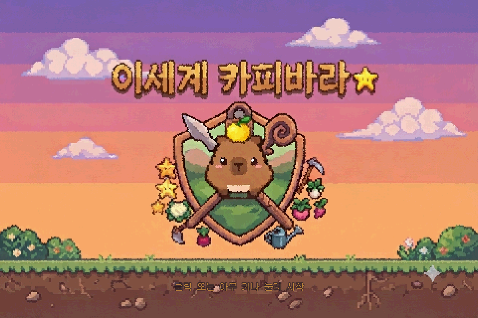

# 이세계 카피바라 (Capybara Escape)

도트 카피바라를 꾸며 입장해, **제한시간 3분 안에 미션 5개를 끝내고 탈출**하는
웹 브라우저 탑다운 타임어택 게임.

> NAN 2026 Game × AI 해커톤 **사전 과제 제출작**
> 팀: 이해진(팀장·개발) · 지승제(기획·문서) · 유한결(아트·영상)

---

## ▶ 지금 바로 플레이 — 설치 없음

### https://leehaejin02.github.io/capybara-escape/

링크를 열면 바로 실행됩니다. 설치·계정·다운로드가 필요 없습니다.
데스크톱 브라우저(Chrome · Edge · Firefox) + 키보드 · 마우스 기준입니다.

## ▶ 플레이 영상 (54초)

### https://www.youtube.com/watch?v=qspGQt6AvOA



---

## 어떤 게임인가

맵 좌하단에서 시작해 **우상단 탈출구**로 나가야 하는데, 탈출구는 **미션 5개를 끝내기
전에는 열리지 않습니다.** 맵에는 고블린 3마리가 순찰하고, 그 시야에 들어가면 추격당합니다.

미션은 배선을 잇거나, 온천 온도를 맞추거나, 점멸 순서를 외우는 짧은 미니게임입니다.
그리고 **미션을 하는 동안 카피바라는 한 발짝도 움직일 수 없습니다.**

이 게임의 긴장은 「미션 중에는 움직일 수 없다」 하나에서 나옵니다.

| | |
|---|---|
| **조작** | 방향키 / WASD 이동 · **E** 상호작용 · **Shift** 대시 · **M** 음소거 |
| **종료 조건** | 탈출 성공 / 제한시간 180초 소진 / 체력 0 |
| **맵** | 3종(고블린 집터 · 숲 · 동굴) 무작위 |
| **커스터마이즈** | 몸 4 × 옷 5 × 모자 6 = **120조합**, 런타임 3레이어 합성 |

---

## 소스에서 실행하기

```bash
git clone https://github.com/leehaejin02/capybara-escape
cd capybara-escape
npm ci
npm run dev      # 개발 서버
```

| 명령 | 하는 일 |
|---|---|
| `npm run dev` | 개발 서버 실행 |
| `npm run build` | 정적 빌드 → `dist/` (경계 검사 선행) |
| `npm run sim` | **헤드리스 시뮬레이터** — 브라우저 없이 게임 규칙만 실행 |
| `npm run check` | `src/sim/`이 Phaser를 import하지 않는지 정적 검사 |

**Node.js 24**에서 확인했습니다. 유료 라이선스가 필요한 도구는 없습니다
(의존성 4개: `phaser` · `vite` · `typescript` · `@types/node`).

---

## 구조

```
src/sim/            게임 규칙 — Phaser를 import하지 않는다. Node에서 단독 실행된다
src/scenes/         렌더 (Phaser). sim의 상태를 그리기만 한다
src/config/balance.ts   모든 밸런스 수치의 유일한 원본
scripts/check-boundary.mjs   위 경계를 빌드 경로에서 강제하는 정적 스캐너
.claude/agents/     AI 에이전트 5종 정의 (director / gd / tech / playtest / verify)
```

**게임 규칙과 렌더를 분리해 둔 덕에 `npm run sim`으로 밸런스를 헤드리스로 측정할 수 있습니다.**
이 경계는 관습이 아니라 `npm run build` 경로에 걸린 검사기가 강제합니다.

## 문서

| 문서 | 내용 |
|---|---|
| [`docs/SUBMISSION_GAME_INTRO.md`](docs/SUBMISSION_GAME_INTRO.md) | 게임 소개 (제출물 3번) |
| [`docs/SUBMISSION_AI_TECH.md`](docs/SUBMISSION_AI_TECH.md) | **AI 활용 기술 문서** (제출물 4번) |
| [`docs/SUBMISSION_TEAM_ROLES.md`](docs/SUBMISSION_TEAM_ROLES.md) | 팀원 롤 기술서 (제출물 5번) |
| [`docs/GDD.md`](docs/GDD.md) | 게임 기획서 |
| [`docs/DECISIONS.md`](docs/DECISIONS.md) | 되돌리기 어려운 결정과 그 이유 |
| [`docs/ASSET_CREDITS.md`](docs/ASSET_CREDITS.md) | 에셋·의존성 출처와 라이선스 |
| [`CLAUDE.md`](CLAUDE.md) | AI에게 건 금지 조항 16조 |
| [`WORKLOG.md`](WORKLOG.md) | 세션별 작업 기록 |

## 에셋

**제3자에게서 가져온 이미지·오디오 에셋은 0건입니다.**
스프라이트·타일·타이틀은 팀이 직접 생성했고(Google Gemini), 자체 스크립트가 32×32 픽셀아트
규격으로 변환합니다. 마커·수풀·온천 타일은 코드가 그립니다. BGM·효과음은 오디오 파일 없이
Web Audio API로 실시간 합성합니다. 상세는 [`docs/ASSET_CREDITS.md`](docs/ASSET_CREDITS.md).
